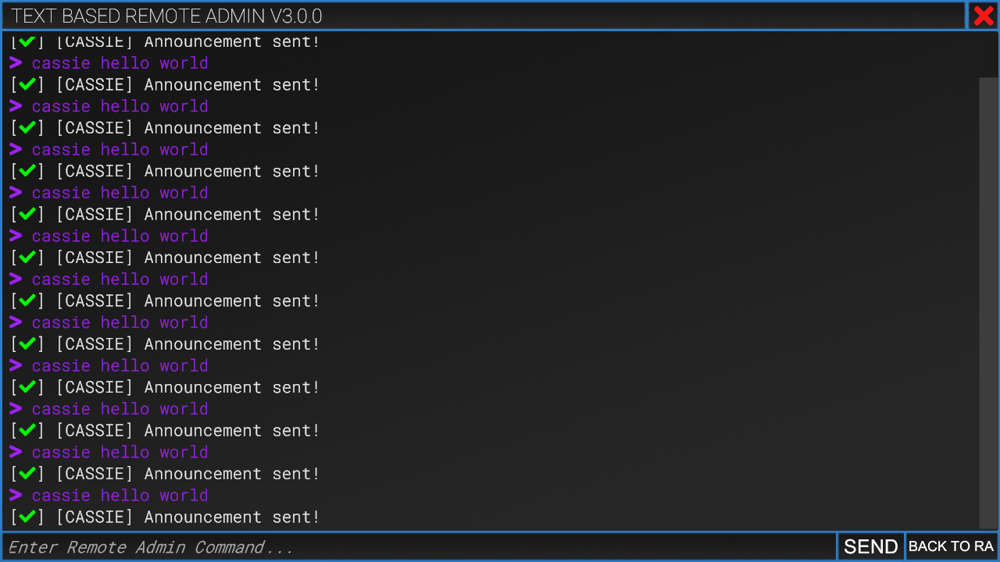

# ❔ Creating the project

In order to create a project for CursedMod you need to have the following tools or requirements:

* [.NET Framework 4.8.X](https://dotnet.microsoft.com/download/dotnet-framework/net48)
* [Visual Studio Code](https://code.visualstudio.com/), [Visual Studio](https://visualstudio.microsoft.com/) or a similar IDE like [Rider](https://www.jetbrains.com/rider/)
* [Brain](https://i.imgur.com/QTPSTEM.gif)

If you are missing something please install it before proceeding.

## Creating the project

For this tutorial we will use [Visual Studio](https://visualstudio.microsoft.com/) as it is free, easy to use and intuitive.

1. Open up Visual Studio and click on `Create a new project` towards the bottom right.

<figure><figcaption>
Visual Studio
</figcaption></figure>

2. Select **Class Library (.NET Framework)**

<figure><figcaption>
Creating a new project
</figcaption></figure>

3. Enter your desired project name, then select the desired **.NET Framework** version (4.8.X)&#x20;

<figure><figcaption>
Selecting .NET Framework 4.8.X
</figcaption></figure>

And voilà! The project is created. You can proceed with the next step! 😊
